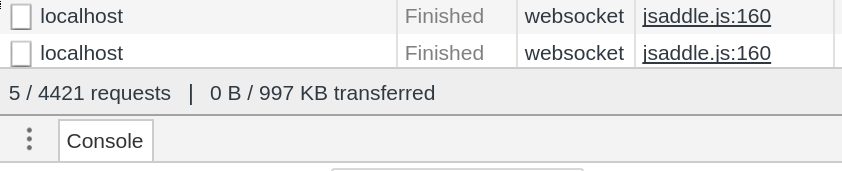

There is a bug which causes many network requests to be made when a websocket
connection fails in jsaddle-warp. Tested in Firefox-55 and Chrome-61, the bug
only happens in Chrome.

To test in ghc:

```

nix-build -A ghc.bug
./result/bin/bug-exe

```

Navigate to `localhost:3800`, open network tab:



This doesn't happen with the ghcjs build:

```

nix-build -A ghcjs.bug

```

Navigate to `result/bin/bug-exe.jsexe/index.html`, open network tab

